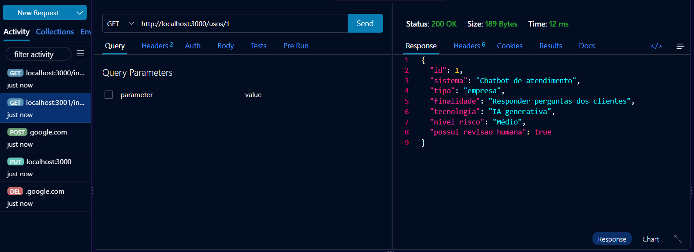
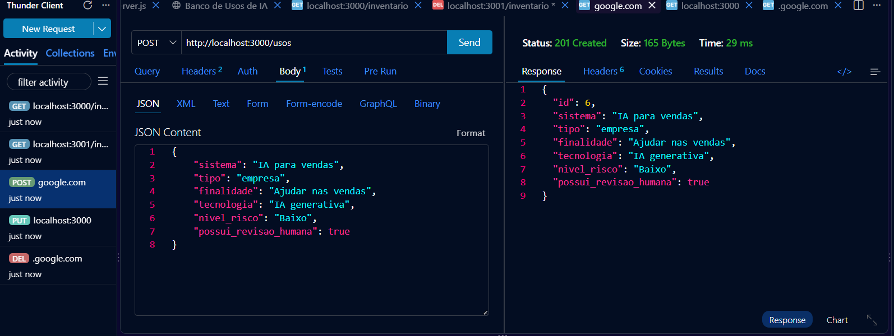
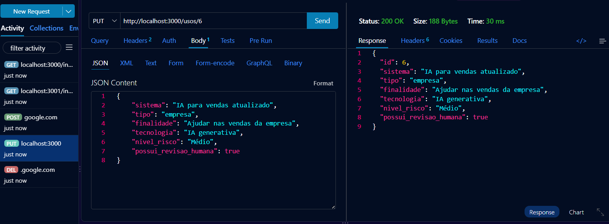
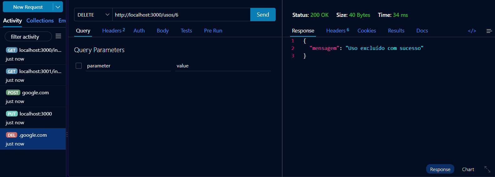
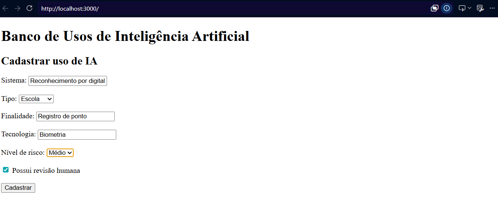
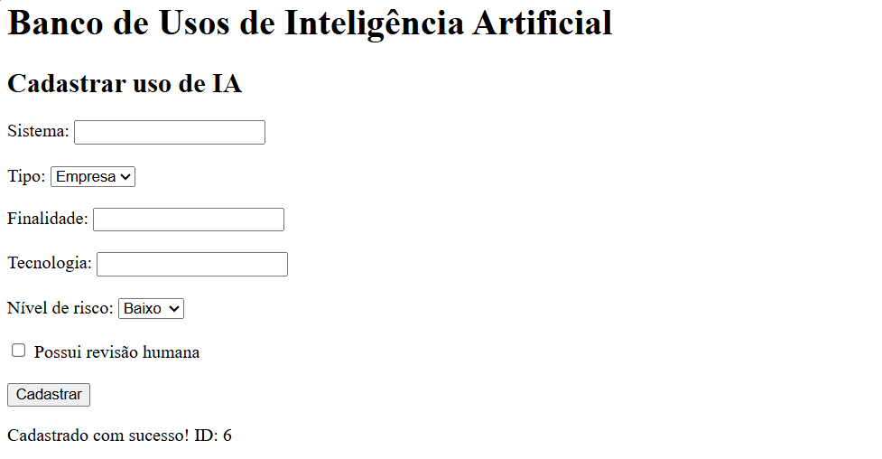
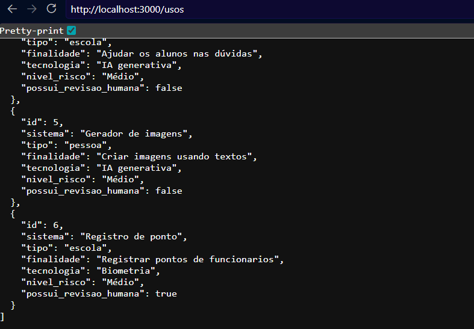

# Pesquisa de Campo - Banco de Usos de IA 

Exemplo simples de back-end para cadastrar e consultar alguns usos de Inteligência Artificial usando JSON 

## Tecnologias

- **Node.js**
- **JavaScript**
- **VS Code**
- **Thunder Client**
- **HTML**
- **JSON**

## Passos para testar

- 1 Clone este repositório

- 2 Abra com **VS Code** e em um terminal digite:

bash
npm install
npm run dev
3 Teste as rotas com a extensão  Thunder Client do VS Code

4 Abra o arquivo client/index.html com a extensão Live Server do  VS Code

## Prints
Ler tudo  

Procurar

Criar

Atualizar

Excluir

## Banco de uso

Cadastrar

Cadastrado

Resposta
# sesi_pbe1_vps01_pesquisa_de_campo_2026

